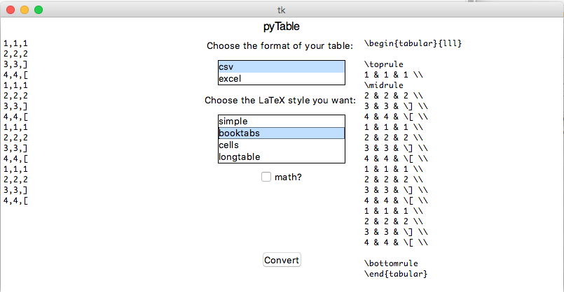

#pyTable2LaTeX

A Python program with GUI to convert csv/Excel Tables to LaTeX codes

## Download
[v1.0.0](https://github.com/jingnanshi/pyTable2LaTeX/releases/tag/v1.0.0)

## Instructions
You can either run the Python script from command lines, or run the executable compatible with your platform. The GUI is self-explanatory.

## Screenshot

## Known Issues
1. Most of the special symbols are not converted right now.

by Jingnan Shi @ Harvey Mudd College
