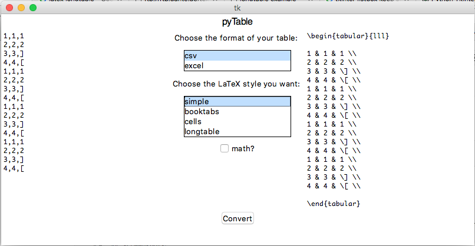

#pyTable2LaTeX

A Python program with GUI to convert csv/Excel Tables to LaTeX codes

## Instructions
You can either run the Python script from command lines, or run the executable compatible with your platform.

## Screenshots

by Jingnan Shi @ Harvey Mudd College
